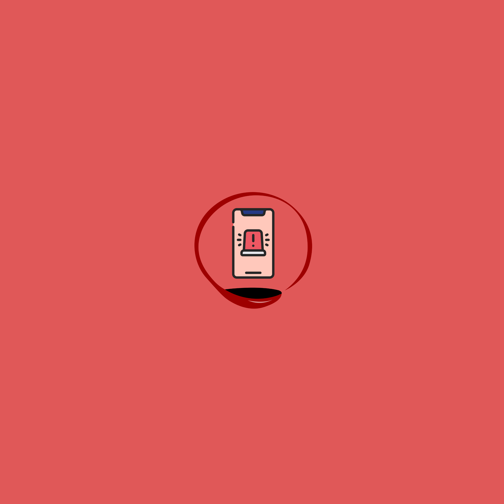
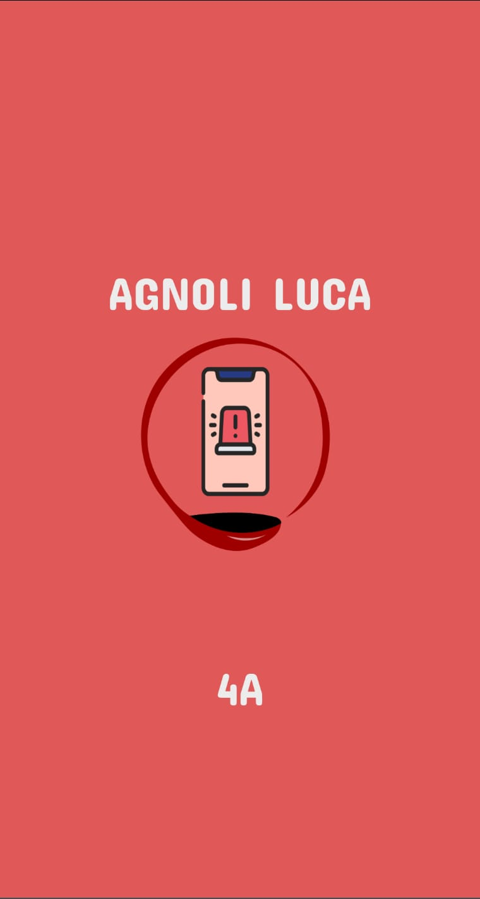
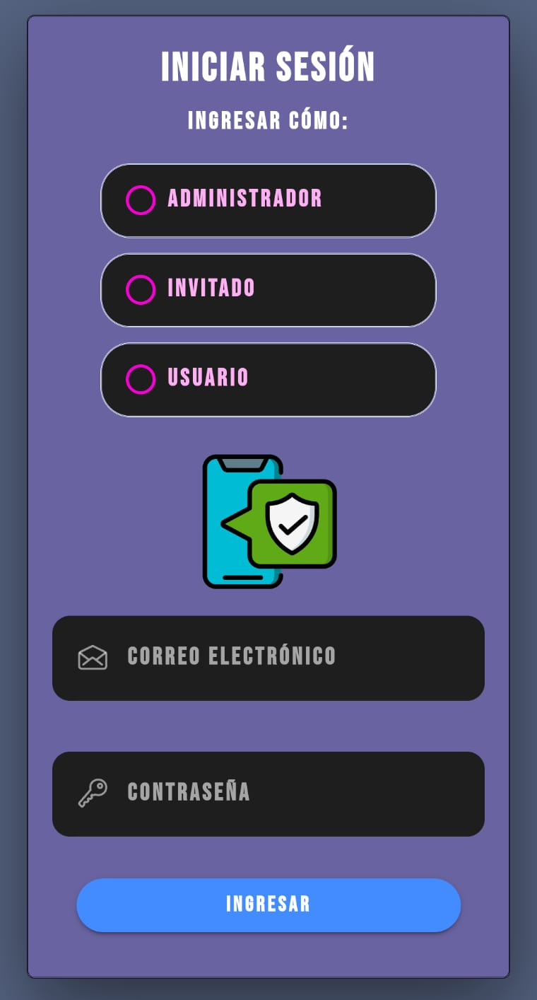
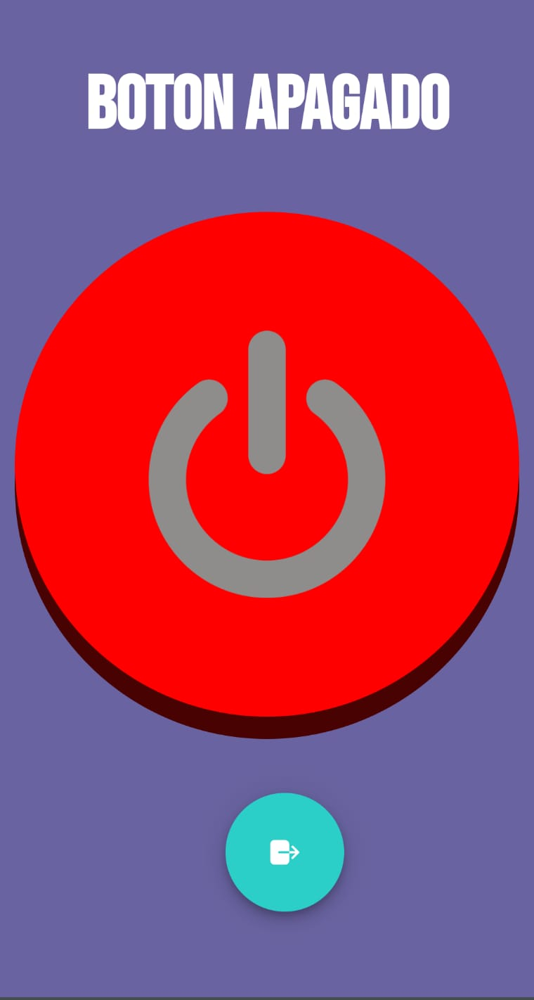
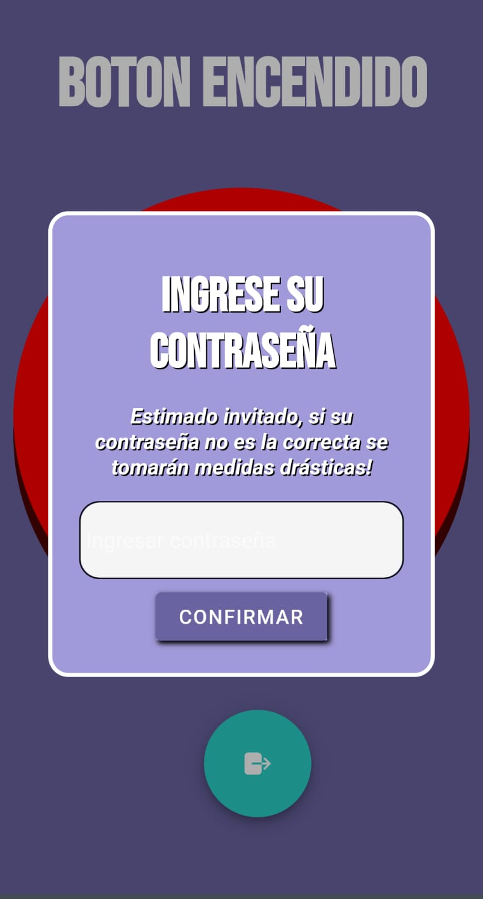

# AppAlarmaRobo

## Capturas de pantalla

#### Splash Screen

#### Login

#### Inicio
Al apretar el botón se activa la alarma. Cualquier movimiento accionará un audio que indicara que se desplazó al celular de su posición.
<table>
  <tr>
    <td></td>
    <td></td>
    <td></td>
  </tr>
</table>

